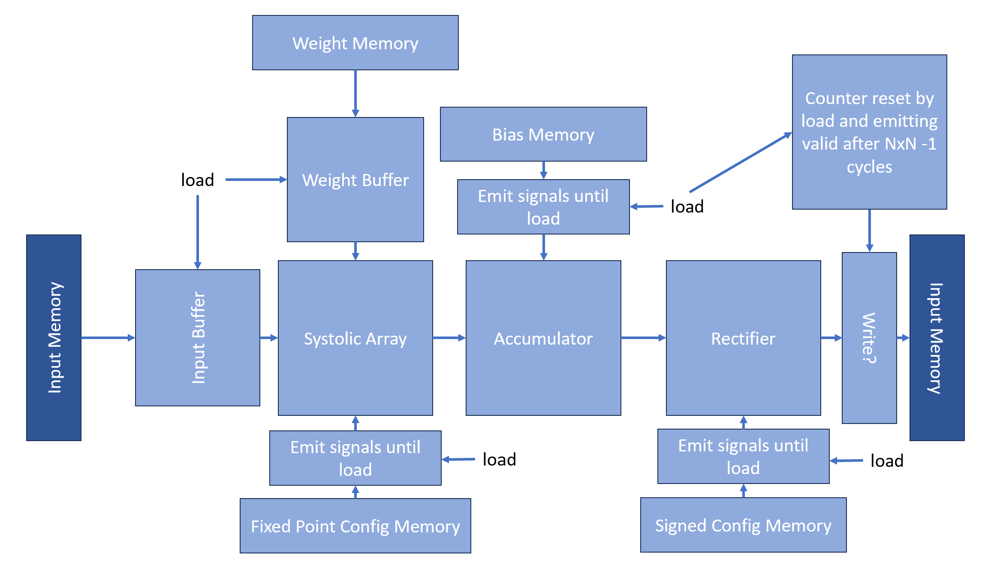

Hardware Accelerator for Neural Networks in Chisel
=======================
This repository documents a Neural Network Accelerator architecture and its implementation.\
It is written in Chisel 5.0 and targets the Basys3 FPGA board.

The project is part of a Special Course at the Technical University of Denmark (DTU).

### Authors

Andreas Lildballe (s214387) \
Ivan Hansgaard Hansen (s214378)

## Repository Structure


## Motivation

Moore's law is coming to a halt and computing requirements are ever-increasing.
To accommodate these requirements domain-specific architectures (DSA) are positioned to become more important in the
future.

One area of increasing computing requirements is within the field of neural network inference.
This is done through matrix multiplications that are highly expensive in terms of computing power and memory access.

By implementing a hardware accelerator for neural networks in an FPGA, we can offload the matrix multiplications from
the CPU to
an FPGA, which can be tailored to be more efficient at these types of operations, mainly by reducing the amount of
memory access.
The main way of achieving this is treating matrices as the primitive datatype, as opposed to a scalar.
By fetching entire matrices at a time, there is no need to fetch each element individually, which is a time expensive.
This is especially true for large matrices, which are common in neural networks (see below).

By making a scalable design in the FPGA, the performance costs can as well be fitted to the requirements of the Neural
Network. It also allows us to make a highly specialized design, which is not possible in a general purpose CPU.

Chisel is a hardware construction language embedded in Scala, which allows for a more high-level description of
hardware, and is therefore ideal to describe such a scalable design.

## Neural Network Basics

A neural network is a machine learning model, which is said to be inspired by the human brain.
It consists of a series of layers, which each consist of a series of neurons.
Each neuron is connected to all neurons in the previous layer, and each connection has a weight associated with it.
The neuron then computes the weighted sum of the inputs, adds a bias value, and applies an activation function to the
result.
The activation function is typically a non-linear function, which allows the network to learn non-linear functions.
The biases allow the network to learn the offset of the activation function.

#### Training

The process of computing the weights and biases is known as training, but this is not implemented in the
accelerator. The networks are often trained using a framework such as [PyTorch](https://pytorch.org/)
or [TensorFlow](https://www.tensorflow.org/),
and then stored in a format such as [ONNX](https://github.com/onnx/onnx)
or [TensorFlow Lite](https://www.tensorflow.org/lite).
We will treat the weights and biases as constants, and only implement the inference part of the network.

#### Inference

Inference is the process of computing the output of the network given an input. This is covered below.

The values in a layer are typically represented as a vector or a matrix,
and the weights are represented as a matrix as well.
This allows for a matrix multiplication to be used to compute the weighted sum of the inputs.
This is done for each neuron in the layer.
The process is then repeated for each layer in the network, resulting in large amounts of matrix multiplications.

The computation in a layer can be represented by the following formula:

```
Y = f(W * X + B)
```

Where Y is the output of the layer, f is the activation function,
W is the weight matrix, X is the input matrix and B is the bias matrix.
Examples of activation functions are the sigmoid function and the rectified linear unit (ReLU) function.

The ReLU function is the most commonly used, and
is defined as:

```
f(x) = max(0, x)
```

#### Number representation

Neural networks can be implemented with varying number representations, but fixed point numbers are often used due to
their hardware friendliness.
The precision of the fixed point number can often
vary between layers, and even within a layer.

The accelerator currently supports a predefined fixed point format that is the same for all layers.
The infrastructure for differing between layers is half implemented, but not used.
If desired the accelerator can also operate on pure integers.

## Design & Implementation

### Systolic Array

The core of the design is the Systolic Array,
which is a scalable and pipelined algorithm for fast matrix
multiplication,
also seen on Googles TPU [1]. It allows us to perform the W * X operation in the layers efficiently.
The array consists of NxN processing elements (PE).
Each PE function as a multiplier and accumulator (MAC) unit implementing the following operation:

```
c = a * b + c
```

Where a and b are the scalar inputs to the PE and c is a stored value alongside the final result.

Notably the design handles fixed point numbers, and multiplication must therefore be handled with care,
to ensure that the result is correctly represented in the defined fixed point format. E.g, a multiplication of an
input and a weight both in (4,4) fixed point format should result in a (4,4) fixed point format as opposed to a
(8,8) fixed point format.
This is done through a rounding algorithm that rounds up to nearest with round up on tie and implemented using shifting.

Each clock cycle the PE passes on a and b in opposite directions, while c is stored locally.
If the values inputted into the array are formatted correctly, the result of the matrix multiplication
will be stored across all c values after N * N - 1 clock cycles.


<figure>
    <p align = "center">
        
        <figcaption>
            Example of connections in a 3x3 Systolic Array (figure self produced).
        </figcaption>
    </p>
</figure>

A detailed and visual example computation of a 3x3 systolic array across 8 clock cycles can be seen in the gif below
or as a pdf [`here`](docs/systolic_array_example.pdf).

<!---
Remove comment in final version
<figure>
    <p align = "center">
        
        <figcaption>
            Example of an integer computation in a 3x3 Systolic Array (gif self produced).
        </figcaption>
    </p>
</figure>
-->

The PE and the Systolic Array are implemented in the
[`ProcessingElement`](src/main/scala/systolic_array/ProcessingElement.scala)
and
[`SystolicArray`](src/main/scala/systolic_array/SystolicArray.scala)
modules respectively. The rounder is implemented in the
[`Rounder`](src/main/scala/systolic_array/Rounder.scala) module.

A datapath is build around the Systolic Array to
enable it to be used as a full layer neural network accelerator.
This datapath is designed to interface with a memory component and a control component,
which in turn can interface with a communication module, which
currently is implemented as a UART module.

Below we will go through the different components of the datapath.

### Shifted Buffers

The inputs to the systolic array, the weights and inputs, have to formatted correctly. This is done in part through a
series of
[`ShiftedBuffer`](src/main/scala/ShiftedBuffer.scala) modules.
The buffers are implemented as a series of shift registers, which shift the input values into the systolic array,
with a load signal to enable loading values from the memory into the entire series at the same time.
The values loaded from the memory have to follow a certain format, that is described in more detail in the
[`Memory & Encodings`](#memory--encodings) section.

A visual example of the three instances of buffers with different shifts can be seen below:

<figure>
    <p align = "center">
        
        <figcaption>
          Three instances of buffers with different shifts. Orange registers are initialized to 0. 
          Blue registers are initialized to values from memory (figure self produced).
        </figcaption>
    </p>
</figure>

### Accumulator

The accumulator is a rather simple module, which is used to accumulate
the results of the systolic array to the biases.
Performing matrix addition is simply a matter of adding the values in the same position in the matrices.
There is taken no care to ensure that the result is representable in the defined fixed point format,
which can cause error if overflow occurs.

It can found described in the
[`Accumulator`](src/main/scala/Accumulator.scala) module.

### Rectifier

Following the accumulation we reach the activation function, where currently only the ReLU function is implemented.
This is done in the
[`Rectifier`](src/main/scala/Rectifier.scala) module.
This module utilizes the fact that the ReLU function readmits the input if it is positive, i.e., if the input is not
signed then the output is the same as the input.
If the input is signed, then a negative inputs sign bit is set to 1, and the sign bit is always the most significant
bit.
Therefore, the module simply checks the most significant bit and sets the output to 0 if it is 0.

Normally the next step would be to normalize the result, but this is not implemented in the accelerator as this would
require division, which is a very expensive operation in hardware and would therefore best be left to the CPU.

### Memory & Encodings

The memory is divided into five different parts to allow for separation of the different types of data.

The first three are matrix storing memories for the input, weights and biases respectively:

- Input memory
- Weight memory
- Bias memory

The remaining two are used to store configuration values, like the fixed point format of the input and weights
and whether the values are signed:

- Fixed Point Config Memory
- Signed Config Memory

Notably the latter three memories have their matrix data encoded in such a way that it is directly
transferable to the systolic array.
Below is an example of how the input memory is encoded for a 3x3 matrix with three different possible layers:

<figure>
    <p align = "center">
        
        <figcaption>
            (figure self produced).
        </figcaption>
    </p>
</figure>

Similarly, the weight memory is encoded for the example as:

<figure>
    <p align = "center">
        
        <figcaption>
            (figure self produced).
        </figcaption>
    </p>
</figure>

When transcribed to the buffers and systolic array, the computation is then valid and would result
in the following format:

The bias memory is therefore encoded as:
<figure>
    <p align = "center">
        
        <figcaption>
            (figure self produced).
        </figcaption>
    </p>
</figure>

TODO: fixed point and signed config

The input memory is implemented as a read-write memory, while the remaining memories are implemented as read-only

All memories are currently implemented as registers to comply with the Basys3 board and to allow for easy
implementation.

The memories are described in
[`Memories`](src/main/scala/Memories.scala).

### Layer Calculator (Accelerator Datapath)

With all of the above components, we can now assemble the layer function, which is the core of the accelerator.
This is implemented as a datapath that can be controlled by a finite state machine (FSM).
The description of the datapath is found in the
[`LayerCalculator`](src/main/scala/LayerCalculator.scala) module.

TODO: update drawing
<figure>
    <p align = "center">
        
        <figcaption>
            Data path of the accelerator (figure self produced).
        </figcaption>
    </p>
</figure>

### Datapath Controller

The controller of the datapath, called LayerFSM, is implemented as a FSM in the
[`LayerFSM`](src/main/scala/LayerFSM.scala) module.

The FSM is implemented as a Moore machine, which means that the
output of the FSM is only dependent on the current state.

The FSM has the following five states:

- Idle
- Load
- Calculating
- Write
- Finished

The FSM is initialized in the Idle state, and will stay in this state until the start signal is asserted.

When the start signal is asserted, the FSM will transition to the Load state, where it will load the input, weights
and biases into the buffers from the memories. Various values within the datapath will also be
reset to accommodate the incoming values.

When the loading is finished after a clock cycle, the FSM will transition to the Calculating state, where it will start
the systolic array and accumulator. After NxN - 1 cycles it the datapath will be finished calculating the result
and a 'valid' signal will be asserted.

When the 'valid' signal is asserted, the FSM will transition to the Write state, where it will
write the result to the output memory.

When the writing is finished, currently after one cycle due to the register memory, the FSM will transition to the
Finished state, where it will assert a 'finished' signal to the component that asserted the start signal.

After a clock cycle, the FSM will transition back to the Idle state, where it will stay until the start signal is
reasserted.

### Communication

#### UART Protocol

#### Receiver

#### Transmitter

<figure>
    <p align = "center">
        
        <figcaption>
            Data path for layer function (figure self produced).
        </figcaption>
    </p>
</figure>

### Top-level
The communication module is then connected to the datapath, its controller and the memories in the
[`Accelerator`](src/main/scala/Accelerator.scala) module.
This module functions as the top-level module of the accelerator. 
It provides a series of debug signals to allow for inspection of the internal state of the accelerator.

## Unit Tests and Verification
To verify the functionality of the accelerator, a series of unit tests have been written.
These can be found in the [`test`](src/test/scala) folder.

The tests roughly corresponds to the different modules in the design.

A subset of the tests are listed below:
- A test of the systolic array, which tests the 
functionality of the systolic array and the rounder, 
with the possibility of easily matrix dimensions and fixed point format.
It automatically compares the result of the systolic array to the result of a matrix multiplication in software, 
both in fixed point and inferred to floating point.
- A test of the entire layer function datapath, with the same functionality as the systolic array test.
- A test of the shifted buffer module, confirming its behavior.
- Various tests of the byte buffers.
- A test for the Accelerator module transmitting commands through the UART,
and then inspecting the internal state of the accelerator.

Testing though UART commands proved to be a quite cumbersome process, 
as an enormous amount of cycles are required to transmit the data, thereby slowing down the testing framework.

## Synthesis
Synthesis of the design was done using the AMD Vivado Design Suite 2023.2.
The xdc file used for the target board can found [here](Basys3_Master.xdc).

The utilization of the FPGA resources varies depending on the configuration of the accelerator.
Below is a table of the utilization of the FPGA resources for different configurations:

| Dimensions | Bit width | LUTs | FFs | DSPs | BRAMs |
|------------|-----------|------|-----|------|-------|
| 3x3        | 4         |  1   |  1  |  0   |  0    |
| 3x3        | 8         |  1   |  1  |  0   |  0    |
| 3x3        | 13        |  1   |  1  |  0   |  0    |
| 3x3        | 16        |  1   |  1  |  0   |  0    |
| 3x3        | 32        |  1   |  1  |  0   |  0    |
| 5x5        | 16        |  1   |  1  |  0   |  0    |
 

## Interfacing
To interface with the accelerator an easy way to send commands and receive data though UART is needed. 
For this purpose a C# application was written, which can be found in the [Interface](Interface) folder.

C# was chosen due to our familiarity with the language, and good support for serial communication.

The application is a simple console application, which allows the user to send commands to the accelerator,
and receive data from the accelerator.


## References

    [1]: Patterson, David A., and John L. Hennessy. Computer Architecture: A Quantitative Approach, Sixth Edition (2019). Chapter 7.4. 
    [2]: 
